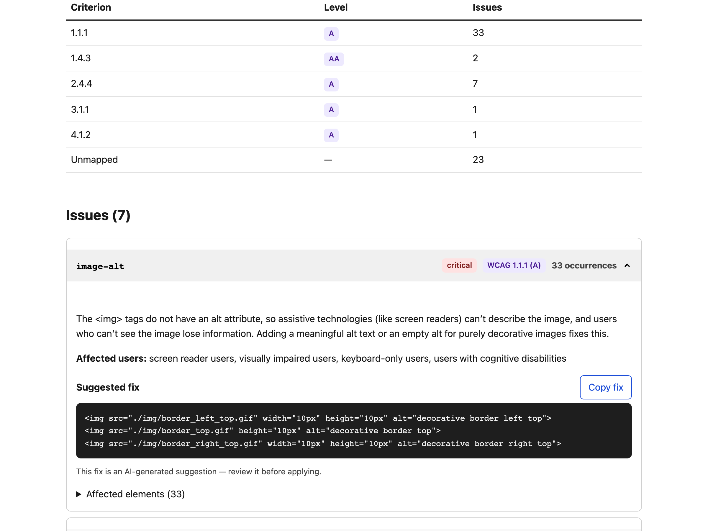
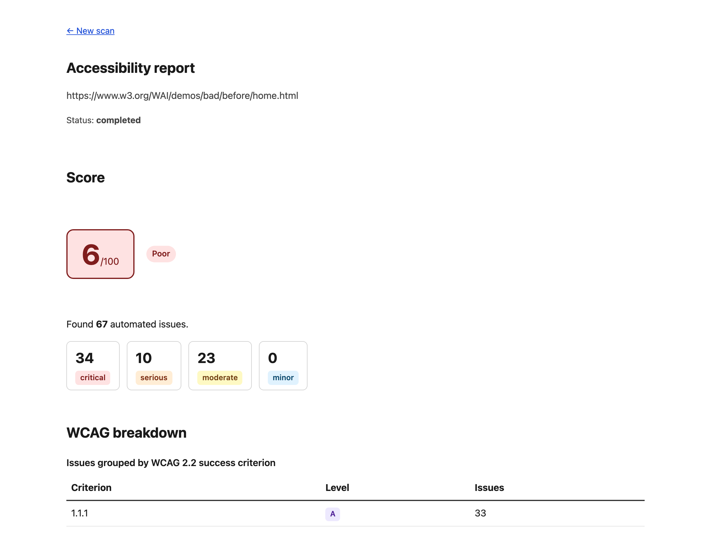

# AllyFix

**Open-source accessibility auditor that tells you _why_ each WCAG issue matters and _how_ to fix it — right in your code.**

Automated scanners tell you _what_ is broken. AllyFix scans a page with axe-core,
then uses an LLM to explain each issue in plain language and generate a concrete,
copy-able code fix.

<p align="center">
  
</p>

## 🔗 Live demo

**[ally-fix-web.vercel.app](https://ally-fix-web.vercel.app)** — try it, or open a pre-run report:

| Site scanned                                                                                  | Score                   | Report                                                                              |
| --------------------------------------------------------------------------------------------- | ----------------------- | ----------------------------------------------------------------------------------- |
| [a11yproject.com](https://www.a11yproject.com) — built for accessibility                      | **100 / 100**           | [view](https://ally-fix-web.vercel.app/audits/117d1422-f8e6-4a87-a6ae-064e4cbcd058) |
| A large e-commerce homepage                                                                   | **5 / 100** (82 issues) | [view](https://ally-fix-web.vercel.app/audits/190fbd67-bc34-41b0-8c63-e72ae5557c75) |
| [W3C "before" demo](https://www.w3.org/WAI/demos/bad/before/home.html) — intentionally broken | **6 / 100** (67 issues) | [view](https://ally-fix-web.vercel.app/audits/14b757d5-86c6-4eb6-b376-60c4cd77e700) |

> The web app is always online. The scanner worker runs **on demand** (a Playwright +
> Chromium worker can't run for free always-on), so a _brand-new_ scan finishes only
> while the worker is running — the sample reports above are pre-computed and always
> viewable. See [`DEPLOY.md`](./DEPLOY.md) for the model.

> ⚠️ Automated scans (axe-core) catch roughly 30–40% of WCAG success criteria and
> cannot replace manual testing with assistive technology. AllyFix reports are not a
> legal certification of compliance.

## What it does

- **Scores** a page 0–100, severity-weighted (a few critical issues hurt far more than many minor ones).
- **Groups** issues by WCAG 2.2 success criterion, with A / AA levels.
- **Explains + fixes** each issue with an LLM: the problem in plain language, who it affects, and a copy-able code fix.
- **Shares** every report at a stable URL.

<p align="center">
  
</p>

The dashboard is itself built to **WCAG 2.2 AA** — semantic landmarks and headings,
visually-hidden labels, visible focus, and tint-plus-dark-text badges for contrast.
It's dogfooded with axe and reports **zero** WCAG A/AA violations.

## Architecture

```
Next.js (web)  ──►  API route  ──►  BullMQ queue (Redis)
                                          │
                                          ▼
                              Worker: Playwright + axe-core
                                          │
                          raw issues ─────┤────► LLM layer (explain + fix)
                                          ▼
                                     PostgreSQL  ──►  Report dashboard
```

The **worker is a separate service** because Playwright needs a heavy Chromium
binary that cannot run on Vercel's serverless runtime. SSRF protection (blocking
localhost, private IPs, and cloud metadata) is enforced both at the API and at
scan time, covering redirects and DNS rebinding.

## Tech stack

- **TypeScript** everywhere, **pnpm** workspaces monorepo.
- **Next.js** — web frontend and API routes.
- **Playwright** + **@axe-core/playwright** — the scanner.
- **BullMQ** + **Redis** — job queue and LLM result cache.
- **PostgreSQL** + **Drizzle ORM** — storage (JSONB for raw axe output).
- **Vercel AI SDK** — provider-agnostic LLM layer (Ollama / Groq / Gemini),
  structured output validated with **Zod** and retried on failure.
- **Radix UI** — accessible accordion primitives.
- **Docker Compose** — run the whole stack with one command.
- **Vitest** + **GitHub Actions** — tests and CI (lint, typecheck, test) on every PR.

## Monorepo layout

```
ally-fix/
  apps/
    web/         Next.js: frontend + API routes
    worker/      Playwright + axe-core scanner (separate service)
  packages/
    db/          Drizzle schema + Postgres client
    llm/         Provider-agnostic LLM layer
    shared/      Shared Zod schemas, types, SSRF guard, and scoring
  docker-compose.yml
  .env.example
```

## Run it locally

Requires **Node 22.13+**, **pnpm**, and **Docker**.

```bash
# 1. Install dependencies
pnpm install

# 2. Configure environment (the defaults already match the Docker services below)
cp .env.example .env

# 3. Start Postgres + Redis + the worker + the web app
docker compose up -d

# 4. Create the database tables (run once)
pnpm db:migrate
```

Then open **http://localhost:3000**, paste a public URL — try
`https://www.w3.org/WAI/demos/bad/before/home.html` — and click **Scan**. In a few
seconds you'll get a report with the accessibility score, a WCAG breakdown, and
each issue's explanation and code fix.

To stop everything: `docker compose down`.

### AI explanations

The default LLM provider is **Ollama** (local, free). Install it and pull a model
(`ollama pull llama3.1`), **or** switch to a hosted key in `.env`:

```bash
LLM_PROVIDER=groq
GROQ_API_KEY=gsk_...            # from https://console.groq.com
GROQ_MODEL=openai/gpt-oss-20b
```

Without a provider, scans still work — issues just won't have AI explanations
(the analysis step is best-effort and never fails a scan).

### Useful scripts

```bash
pnpm lint         # ESLint across the monorepo
pnpm typecheck    # TypeScript, all packages
pnpm test         # Vitest, all packages
pnpm build        # production build
pnpm db:generate  # regenerate Drizzle migrations after a schema change
```

## Deployment

See [`DEPLOY.md`](./DEPLOY.md). The recommended $0 setup keeps the web app always
online on **Vercel** (with **Neon** Postgres and **Upstash** Redis on free tiers)
and runs the Playwright worker **on demand** from your machine
(`pnpm --filter @ally-fix/worker start:demo`). Per-IP daily rate limiting protects
the shared demo key. A fully hosted, always-on option (Docker worker on Render/Fly)
is documented too.

## Bring your own key

AllyFix never hardcodes or stores API keys. Ollama runs locally for free by default.
If you supply a Groq or Gemini key, it lives only for the duration of your session —
it is never written to the database, logged, or sent anywhere but the provider itself.

## Status

Built in phases:

- ✅ **Phase 1** — URL input, SSRF protection, BullMQ + Playwright/axe scan, raw issues in Postgres and UI.
- ✅ **Phase 2** — provider-agnostic LLM layer (Ollama/Groq/Gemini) with Zod-validated structured
  output, batching by rule, and Redis caching. Analysis is best-effort: a missing LLM provider
  never fails a scan.
- ✅ **Phase 3** — report dashboard: severity-weighted score, WCAG 2.2 breakdown, expandable issues
  (Radix accordion) with copy-fix and shareable link. Dashboard passes axe WCAG 2.2 A/AA with zero violations.
- ⏳ **Phase 4** — polish (sitemap multi-page, scan comparison, PDF export, embeddable badge).

## License

MIT
